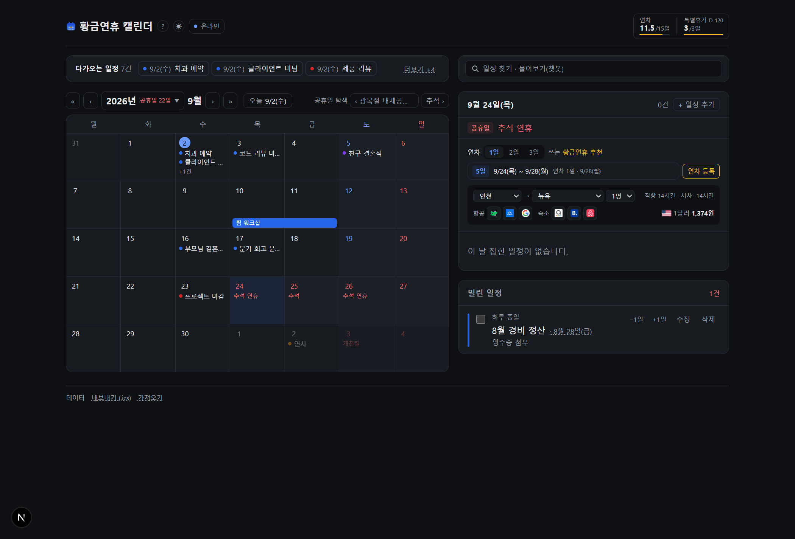

# 황금연휴 캘린더

연차를 **언제 쓰면 가장 오래 쉬는지** 찾아 주는 한 화면짜리 일정 관리 앱.

달력에서 아무 날이나 누르면 그 날이 들어가는 연휴 조합을 연차 사용일수(1·2·3일)별로 보여
준다. 공휴일이 없는 주에도 "이 날 하루 쓰면 며칠 쉬나"가 나온다.

```
연차 [1일] 쓰는 황금연휴 추천
  [5일]  9/24(목) ~ 9/28(월)   연차 1일 · 9/28(월)      [연차 등록]
```

| 라이트 | 다크 |
| --- | --- |
|  |  |

## 하는 일

| | |
| --- | --- |
| **징검다리 연휴 추천** | 고른 날이 낀 연휴 조합을 연차 수별로. 이미 일정이 있는 날은 제외 |
| **일정 관리** | 추가·수정·완료·삭제, 기간 일정, 반복, 색, 준비물 체크리스트 |
| **공휴일** | 5년치를 **규칙으로 생성**. 음력(설·추석·석가탄신일)과 대체공휴일 포함 |
| **휴가 잔고** | 종류마다 다른 주기 — 연차는 입사일 기준, 특별휴가는 연말 소멸 |
| **시간 겹침** | 같은 날 겹치는 시각을 표시만 한다 (저장은 막지 않는다) |
| **항공·숙소·환율** | 추천 연휴의 날짜가 채워진 검색 링크 + 환산액 |
| **일정 챗봇** | "이번 주 뭐 있어?" — 도구로 실제 DB를 읽고 답한다 |
| **구글 캘린더** | OAuth로 가져오기 (읽기 전용) |
| **`.ics` 가져오기·내보내기** | 미리보기 → 확인 → 통째로 되돌리기 |
| **온라인 / 오프라인** | 밖으로 나가는 기능을 한 번에 끈다 (폐쇄망용) |

## 스택

- **Next.js 16** (App Router, Turbopack, TypeScript) · **Tailwind CSS v4**
- **SQLite — libSQL (`@libsql/client`)** · 로컬은 `data/app.db` 파일, 클라우드는 Turso.
  같은 코드가 양쪽을 다 본다 — 주소만 다르다 (네이티브 빌드 없음)
- 화면 상태(월·선택일·연차 수)는 전부 **URL 쿼리스트링**에 있어 달력에 클라이언트 JS가 없다
- 챗봇만 Claude Agent SDK, 환율만 외부 API(`open.er-api.com`)

## 실행

**Node 24 이상**이 필요하다 (`package.json`의 `engines`).

```bash
npm install
npm run dev            # http://localhost:3000
npm run dev:lan        # 같은 망의 다른 기기에서도 접속 (0.0.0.0)
```

DB는 첫 실행에 `data/app.db`로 자동 생성되고 공휴일 5년치가 들어간다.
초기화하려면 `data/` 폴더를 지우고 다시 띄우면 된다.

## 배포 — 폴더 하나 복사

```bash
npm run package        # → dist/  (약 28MB)
```

`dist/`를 통째로 옮기고 `시작.bat`(리눅스·맥은 `node server.js`)만 실행하면 된다.
받는 쪽에 필요한 것은 **Node 24 하나**뿐이다 — `npm install`도 인터넷도 필요 없다.

> ⚠️ 단, **OS·아키텍처가 만든 PC와 같아야 한다.** libSQL이 로컬 파일을 여는 데
> 네이티브 애드온을 써서 플랫폼 전용 패키지가 한 개 실려 나간다(윈도우에서 만들면
> `@libsql/win32-x64-msvc`). 다른 OS로 옮길 거면 받는 쪽에서 `npm install`을 한 번 한다.

- 인터넷이 없는 곳에서 쓸 거면 `OFFLINE_DEFAULT=1`로 띄운다
- 백업은 `data/app.db` 파일 하나 복사
- `npm run package`는 **dev 서버가 떠 있으면 실패한다** (`.next`를 같이 쓰다 깨진다)

> ⚠️ Vercel·Netlify에는 올릴 수 없다. 서버리스라 파일 시스템이 읽기 전용이고 인스턴스가
> 요청마다 사라져서, **일정을 저장하는 순간 없어진다.** 영구 볼륨을 붙일 수 있는 곳
> (Fly.io·Railway 등)이나 사내 서버에 올린다.

## 배포 — 인터넷에 올리기 (Fly.io)

`Dockerfile`과 `fly.toml`이 들어 있다. 필요한 것은 `flyctl` 하나다.

```bash
fly auth login
fly apps create golden-holiday-calendar        # 이름은 전 세계에서 유일해야 한다
fly volumes create data --size 1 --region nrt  # 일정이 여기 남는다
fly secrets set APP_PASSWORD=고를비밀번호
fly deploy --ha=false                          # ⚠️ --ha=false 없으면 두 대가 뜬다
```

- **머신은 하나여야 한다.** DB가 SQLite 파일 하나이고 볼륨은 머신 하나에만 붙는다.
  두 대가 뜨면 DB도 갈라져서 요청마다 다른 일정이 보인다.
- **비밀번호를 반드시 넣는다.** 이 앱에는 로그인이 없다. `APP_PASSWORD`를 넣으면
  브라우저 기본 암호 창이 뜬다 (`proxy.ts`, 아이디 칸은 아무거나 — 비밀번호만 본다).
- **챗봇은 기본으로 빠진다.** Claude Code 실행 파일이 215MB이고, 자식 프로세스로 뜨느라
  RAM을 요구하며, `ANTHROPIC_API_KEY`를 서버에 둬야 해서 **요금이 그 계정에 붙는다.**
  담고 싶으면 `fly deploy --build-arg WITH_CHAT=1`, 그리고 `fly.toml`의 메모리를
  `1024`로 올리고 `fly secrets set ANTHROPIC_API_KEY=...` `CHAT_DISABLED=`를 맞춘다.
  빼도 검색(`/api/events?q=`)은 그대로 돌아간다 — 챗봇은 팝업에서 한 번 더 눌러야
  도는 보조 경로다.
- 구글 캘린더를 쓸 거면 리디렉션 주소가 `localhost`가 아니다:
  `fly secrets set GOOGLE_REDIRECT_URI=https://<앱이름>.fly.dev/api/google/callback`
  하고 **같은 주소를 구글 콘솔에도** 등록한다.
- 백업은 `fly ssh console -C "cat /app/data/app.db" > app.db` 대신
  `fly ssh sftp get /app/data/app.db`가 안전하다 (WAL 때문에 `app.db` 하나만 떠 오면
  최근 쓰기가 빠질 수 있다 — 화면의 백업 단추를 쓰는 편이 낫다).

## 구글 캘린더 (선택)

없어도 나머지는 모두 동작한다.

1. 구글 클라우드 콘솔 → **Google Calendar API** 사용 설정
2. **OAuth 동의 화면** → 외부 → 테스트 사용자에 본인 계정 추가
3. **사용자 인증 정보 → OAuth 클라이언트 ID → 웹 애플리케이션**
   승인된 리디렉션 URI: `http://localhost:3000/api/google/callback`
4. `.env.local.example`을 `.env.local`로 복사해 값을 채우고 서버 재시작

권한은 **읽기 전용**(`calendar.readonly`)만 받는다. 반복 일정은 구글이 회차별로 펼쳐 준다.

> 테스트 모드에서는 갱신 토큰이 **7일 뒤 만료**되어 다시 연결해야 한다. 이를 피하려면
> 구글의 앱 확인(verification)을 받아야 한다.

## 주의할 점

- **로그인이 없다.** 접속한 사람이 곧 주인이다. `0.0.0.0`으로 열면 같은 망의 누구나
  일정을 읽고 고칠 수 있고, **챗봇 요금도 서버를 띄운 계정에 붙는다.**
- **선거일·임시공휴일은 규칙으로 만들 수 없다.** `lib/holidays.ts`의 `MANUAL_HOLIDAYS`에
  손으로 넣어야 한다 (배포본에서는 못 넣는다 — 알려진 제약).
- `.ics` 가져오기는 **반복 일정의 첫 회차만** 들어온다. 미리보기에서 주기를 직접 고르면
  앱의 반복 기능으로 펼쳐진다.

설계 판단과 그 이유는 [`CLAUDE.md`](./CLAUDE.md)에 정리되어 있다.
